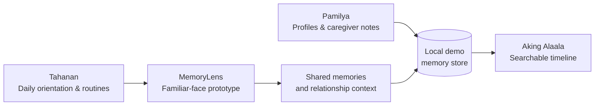

<div align="center">

# Ala-ala

### Your long-time journey partner

A calm, Filipino-first memory companion designed for older adults and the people who care for them.

[](https://flutter.dev)
[](#run-the-app)
[](#what-is-included)

</div>

> **Ala-ala** means *memory* in Filipino. The app gives familiar faces, meaningful moments, and everyday routines a gentle place to live.

## Why it exists

Memory changes can make ordinary moments feel uncertain. Ala-ala is a prototype for a reassuring companion: one that helps a person orient to their day, revisit trusted memories, and stay connected with family—without making technology feel cold or complicated.

## What is included

| Experience | What it does |
| --- | --- |
| **Tahanan** | Welcomes Maria with the date, a daily overview, and simple routines. |
| **MemoryLens** | Demonstrates recognising a familiar person, showing their relationship context, and opening a shared-memory timeline. |
| **Aking Alaala** | Searches the saved memory library using a transparent, source-backed keyword matcher. |
| **Pamilya** | Shows family profiles and lets a caregiver add notes and moments. |

The design uses large tap targets, warm contrast, plain Tagalog prompts, and an intentionally unhurried visual rhythm for older adults.

## Documentation

The [`docs/`](docs/README.md) directory is the source of truth for product intent, system behaviour, data boundaries, and development practices.

| Read | Use it for |
| --- | --- |
| [Product brief](docs/product.md) | Audience, problem, principles, and current scope |
| [Architecture](docs/architecture.md) | App structure, state flow, and module responsibilities |
| [AI & retrieval](docs/ai-and-retrieval.md) | RAG pipeline, Local/Gemini/OpenAI behaviour, and safety limits |
| [Privacy & safety](docs/privacy-and-safety.md) | Data classification and production requirements |
| [Development guide](docs/development.md) | Local setup, checks, and current known limitations |

## Experience map



## Run the app

### Prerequisites

- [Flutter SDK](https://docs.flutter.dev/get-started/install) `3.11` or later
- An iOS Simulator, Android emulator, or physical device configured for Flutter

### Start locally

```bash
git clone https://github.com/darknecrocities/alaala.git
cd alaala
flutter pub get
flutter run
```

To run the widget test:

```bash
flutter test
```

## Project structure

```text
lib/
├── main.dart                 # App shell, theme, and bottom navigation
├── models/                   # Person and Memory data models
├── screens/                  # Tahanan, MemoryLens, Alaala, and Pamilya
├── services/memory_store.dart# In-memory demo data and search behaviour
└── widgets/                  # Reusable cards, routine rows, and Polaroid frame
```

## Data and privacy

This repository is a **demo**. Its sample people, routines, and memories begin fresh whenever the app restarts; no account, cloud service, or API key is needed to run it.

MemoryLens is a UI simulation, not a camera or biometric-recognition implementation. Before using Ala-ala with real personal information, the product needs:

- Explicit, revocable consent for every person whose information is stored or recognised
- Encrypted on-device storage, secure backups, and device-level access protection
- Clear caregiver permissions plus data export and deletion controls
- An on-device camera and face-detection flow that processes biometric data locally by default
- A server-side integration for any cloud AI—never a provider key bundled into the mobile app

An optional [`.env.example`](.env.example) is included as a reminder of the configuration shape for future provider integrations. Copy it to `.env` only when such integrations are actually added; `.env` should never be committed.

## Product direction

- [ ] Replace demo data with encrypted, local-first persistence
- [ ] Add consent, roles, audit history, and data-management controls
- [ ] Build an accessible on-device camera flow for MemoryLens
- [ ] Add voice input and read-aloud responses in Filipino languages
- [ ] Validate the experience with older adults, caregivers, and Filipino families

## Contributing

This is an early prototype. If you contribute, please keep accessibility, dignity, privacy, and low cognitive load at the center of each decision. Run `flutter analyze` and `flutter test` before opening a change.

---

<div align="center">
Built with care for the stories families keep. 🧡
</div>
