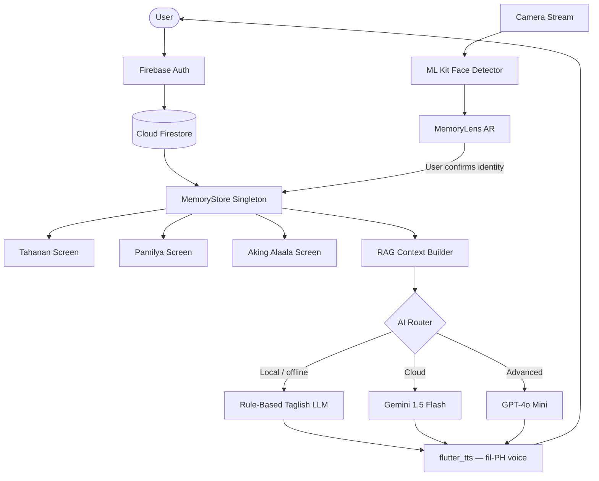

<div align="center">

# Ala-ala 🧡

### Your long-time journey partner

A calm, Filipino-first AI memory companion designed for older adults and the people who care for them.

[](https://flutter.dev)
[](#run-the-app)
[](https://firebase.google.com)
[](#ai-architecture--rag-pipeline)
[](#what-is-included)

</div>

> **Ala-ala** means *memory* in Filipino. The app gives familiar faces, meaningful moments, and everyday routines a gentle place to live — powered by a three-tier AI architecture that works even offline.

---

## Why it exists

Memory changes can make ordinary moments feel uncertain. Ala-ala is a companion that helps a person orient to their day, revisit trusted memories, and stay connected with family — without making technology feel cold or complicated. It is built specifically for **Filipino senior citizens** who may be experiencing mild cognitive impairment (MCI) or early-stage dementia, and for the caregivers who love them.

---

## What is included

| Experience | What it does |
| --- | --- |
| **Tahanan** | Welcomes the user with the date, a daily overview, and simple routine checklists. |
| **MemoryLens AR** | Live camera with ML Kit face detection. Points camera at a person → shows their Polaroid profile card, orbit tags (birthday, food, relationship), and recent memory snippets. |
| **Aking Alaala** | Searchable memory timeline with category filters, emotion tags, and voice memory capture. |
| **Pamilya** | Full family member profiles with caregiver notes. Includes face registration flow via ML Scanner. |
| **Domo AI Assistant** | Always-on floating AI chat button. Responds in warm Taglish with full Text-To-Speech voice playback. |

---

## AI Architecture & RAG Pipeline

Ala-ala uses a **Retrieval-Augmented Generation (RAG)** architecture to ensure the AI assistant responds only from verified, personal memory data — not hallucinated facts.

### The Three-Tier AI Brain

```
┌──────────────────────────────────────────────────────────────────┐
│                        User Query (Chat)                         │
└───────────────────────────┬──────────────────────────────────────┘
                            │
                            ▼
┌──────────────────────────────────────────────────────────────────┐
│                    RAG Context Builder                           │
│                  (memory_store.dart → ai_client.dart)            │
│                                                                  │
│  ┌─────────────────────────────────────────────────────────┐     │
│  │  Structured Context Block                               │     │
│  │                                                         │     │
│  │  ① User Profile     — name, cognitive profile, notes   │     │
│  │  ② People Database  — names, relationships, birthdays, │     │
│  │                        notes, last seen, favorite food  │     │
│  │  ③ Memory Database  — events, categories, tags,        │     │
│  │                        emotions, locations              │     │
│  │  ④ Chat History     — last 10 conversation turns       │     │
│  └─────────────────────────────────────────────────────────┘     │
└───────────────────────────┬──────────────────────────────────────┘
                            │  Assembled Prompt
                            ▼
┌──────────────────────────────────────────────────────────────────┐
│                    Model Selection Router                        │
│                     (AIClient.askAI)                             │
│                                                                  │
│   Preferred model → availability check → graceful fallback       │
│                                                                  │
│   ┌──────────────┐  ┌──────────────────┐  ┌──────────────────┐  │
│   │  Tier 1:     │  │  Tier 2:         │  │  Tier 3:         │  │
│   │  LOCAL       │  │  GEMINI          │  │  OPENAI          │  │
│   │  (Offline)   │  │  (Cloud)         │  │  (Advanced)      │  │
│   └──────────────┘  └──────────────────┘  └──────────────────┘  │
└──────────────────────────────────────────────────────────────────┘
```

### Tier 1 — Local Rule-Based LLM (Offline, always available)

When no API keys are configured or the device is offline, Ala-ala falls back to a **deterministic, rule-based Taglish language model** that runs entirely on-device with zero latency.

**How it works:**
- Receives the RAG context string and user query
- Uses keyword matching against the retrieved context (medicines, family names, doctors, routines)
- Returns contextual Taglish responses using sentence extraction from the retrieved memory block
- Falls back to a warm, comforting default if no match is found

**Design intent:** This tier is modeled after a **quantized, instruction-tuned local LLM** (similar to [Gemma 2 2B-IT](https://huggingface.co/google/gemma-2-2b-it) or [Phi-3 Mini](https://huggingface.co/microsoft/Phi-3-mini-4k-instruct) running via GGUF/llama.cpp), which could be substituted in a production build for full on-device neural generation without any network dependency.

```dart
// Local model: rule-based keyword retrieval over RAG context
String _runLocalModel(String query, String context, String userName) {
  if (lowerQuery.contains('gamot')) {
    // → Answers from matched context sentence about medicine
  }
  // → Falls back to extracting best-matched context sentence
}
```

> In a production deployment, this tier would be replaced with a GGUF-quantized Gemma 2B model loaded via `flutter_gemma` or a local HTTP server running `llama.cpp`, keeping all personal health and memory data fully on-device.

---

### Tier 2 — Google Gemini 1.5 Flash (Cloud)

Uses the **Gemini 1.5 Flash** model via Google's Generative Language REST API for fast, low-cost cloud inference.

```
POST https://generativelanguage.googleapis.com/v1beta/models/gemini-1.5-flash:generateContent
```

**Configuration:**
| Parameter | Value |
|---|---|
| Model | `gemini-1.5-flash` |
| Temperature | `0.3` (controlled, deterministic-leaning) |
| Max output tokens | `300` |
| Language | Taglish (Tagalog-English mix) |

**Prompt style:** The full RAG context is injected directly into the user turn before the question. The system persona instructs Gemini to be "Ala-ala" — warm, caring, and to never hallucinate or say "You forgot."

---

### Tier 3 — OpenAI GPT-4o Mini (Advanced Cloud)

Uses **GPT-4o Mini** via OpenAI's Chat Completions API for the most capable, nuanced responses.

```
POST https://api.openai.com/v1/chat/completions
```

**Configuration:**
| Parameter | Value |
|---|---|
| Model | `gpt-4o-mini` |
| Temperature | `0.3` |
| Max tokens | `300` |
| Auth | Bearer token from `.env` |

**When to use:** Selected by the user via the brain-chip selector in the Domo chat sheet. Ideal for complex queries requiring deeper reasoning over the memory context.

---

### RAG Context Structure

Every AI query receives the following assembled context block:

```
User Profile: Maria
Cognitive Profile: Madalas Makalimot (MCI)
Background Context: Si Anna Santos ang aking anak...

Registered Family & People:
- Anna Santos (Anak): Bumibisita linggo-linggo...
  Favorite food: Sariwang Mangga at Tinola
  Birthday: Oktubre 12
  Last seen: 2026-07-17
  Notes: Sasamahan ka niya sa check-up sa Lunes.; Dinala ang paborito...

- Dr. Cruz (Doktor): Family physician...
  ...

Memories Database:
- [Pangako] Anna Santos: "Pangako ni Anna sa Gamot" — Nangako si Anna...
  (Kahapon, Bahay) [check-up, gamot, pangako]

Recent Conversation:
- User: Kailan darating si Anna?
- Domo: Si Anna po ay darating sa Sabado ng hapon...
```

### Model Fallback Chain

```
User selects Gemini → No GEMINI_API_KEY? → Try OpenAI → No OPENAI_API_KEY? → Local
User selects OpenAI → No OPENAI_API_KEY? → Try Gemini → No GEMINI_API_KEY? → Local
User selects Local  → Always available   → No fallback needed
```

---

## MemoryLens AR — Face Detection Flow

MemoryLens uses **Google ML Kit Face Detection** (on-device, no cloud calls) to identify faces in the live camera stream.

```
Camera Frame (YUV420)
        │
        ▼
   NV21 Converter
        │
        ▼
ML Kit FaceDetector.processImage()
        │
        ├── No face detected → Pulsing scanner reticle (idle state)
        │
        └── Face(s) detected
                │
                ├── _lockedPerson == null?
                │       └── Show "Who is this?" selector card
                │               (list of registered people to pick from)
                │
                └── _lockedPerson set by user
                        └── Show Polaroid card + orbit tags
                                │
                                └── _checkAndGenerateMemory()
                                        └── AIClient.generateMemoryForPerson()
```

> **Important:** ML Kit face detection only detects *that* a face exists — it does **not** identify *who* the person is. Identity confirmation is always done by the user selecting from their registered contacts list. This protects privacy and avoids misidentification.

---

## Text-To-Speech (Senior Accessibility)

Every AI response is read aloud automatically using `flutter_tts`:

| Setting | Value | Reason |
|---|---|---|
| Language | `fil-PH` | Filipino language voice |
| Speech rate | `0.78` | Slower, senior-friendly pace |
| Pitch | `1.0` | Natural tone |
| Auto-play | On every AI reply | No interaction needed |
| Replay | "Pakinggan" button per bubble | On-demand repeat |

---

## Project Structure

```text
lib/
├── main.dart                       # App shell, navigation, Domo AI chat, TTS engine
├── models/
│   ├── person.dart                 # Family member data model (name, photo, notes, birthday)
│   └── memory.dart                 # Memory event model (title, detail, tags, emotion, location)
├── screens/
│   ├── home_screen.dart            # Tahanan — daily orientation & routines
│   ├── lens_screen.dart            # MemoryLens AR — ML Kit camera + face identification
│   ├── memories_screen.dart        # Aking Alaala — searchable memory timeline
│   ├── family_screen.dart          # Pamilya — family profiles & caregiver notes
│   ├── ml_face_scanner_screen.dart # Face capture & registration flow
│   └── auth/
│       ├── login_screen.dart
│       ├── signup_screen.dart
│       └── forgot_password_screen.dart
├── services/
│   ├── memory_store.dart           # Firestore sync, local state, language toggle
│   └── ai_client.dart              # RAG orchestrator — Local / Gemini / OpenAI router
└── widgets/
    ├── app_header.dart             # Global header with logo & settings drawer
    ├── polaroid_frame.dart         # AR face overlay card with transparent viewfinder
    ├── custom_card.dart            # Reusable memory & family cards
    ├── routine_item.dart           # Daily routine checklist row
    └── fade_in_slide.dart          # Entry animation wrapper
```

---

## Data Flow



---

## Run the App

### Prerequisites

- [Flutter SDK](https://docs.flutter.dev/get-started/install) `3.11` or later
- An iOS Simulator, Android emulator, or physical device configured for Flutter
- A Firebase project with Firestore and Authentication enabled
- _(Optional)_ Gemini and/or OpenAI API keys for cloud AI tiers

### Setup

```bash
git clone https://github.com/darknecrocities/alaala.git
cd alaala
flutter pub get
```

Copy the environment template and add your keys _(optional — app works offline without them)_:

```bash
cp .env.example .env
# Edit .env and fill in GEMINI_API_KEY and/or OPENAI_API_KEY
```

Start the app:

```bash
flutter run
```

Run the analyzer and tests:

```bash
flutter analyze
flutter test
```

Build a release APK:

```bash
flutter build apk --release
# Output: build/app/outputs/flutter-apk/app-release.apk
```

### Environment Variables

```env
GEMINI_API_KEY=your_gemini_key_here
OPENAI_API_KEY=your_openai_key_here
```

> `.env` is **never committed** — it is excluded by `.gitignore`. The app gracefully degrades to the local AI tier when no keys are present.

---

## Documentation

The [`docs/`](docs/README.md) directory contains detailed product and technical documentation.

| Read | Use it for |
| --- | --- |
| [Product brief](docs/README.md) | Audience, problem, principles, and current scope |
| [Architecture](docs/architecture.md) | App structure, state flow, and module responsibilities |
| [AI & retrieval](docs/ai-and-retrieval.md) | RAG pipeline, model behaviour, and safety limits |
| [Privacy & safety](docs/privacy-and-safety.md) | Data classification and production requirements |

---

## Key Dependencies

| Package | Purpose |
|---|---|
| `firebase_auth` | User authentication |
| `cloud_firestore` | Cloud sync for people, memories, and user profiles |
| `camera` | Live camera stream for MemoryLens AR |
| `google_mlkit_face_detection` | On-device face bounding box detection |
| `flutter_tts` | Text-to-Speech for AI voice responses (`fil-PH`) |
| `http` | REST calls to Gemini and OpenAI APIs |
| `shared_preferences` | Persist language preference (Tagalog / English) |
| `google_fonts` | Cormorant Garamond and premium typography |
| `provider` / `change_notifier` | Reactive state management |

---

## Data and Privacy

All personal data (names, memories, photos) is stored in **Firebase Firestore** under the authenticated user's UID. No data is shared between accounts.

**AI privacy guarantees:**
- The local AI tier sends **zero data** outside the device
- Cloud tiers (Gemini, OpenAI) receive only the minimum assembled context needed to answer the query — no raw photos, biometric data, or Firebase credentials
- ML Kit face detection runs entirely **on-device** — no face images are sent to any server
- `.env` API keys are **never committed** to version control

---

## Product Direction

- [x] Live camera + ML Kit face detection in MemoryLens AR
- [x] Three-tier AI (Local / Gemini / OpenAI) with graceful fallback
- [x] RAG pipeline with full person profiles, memory database, and chat history context
- [x] Text-to-Speech voice responses in Filipino (`fil-PH`)
- [x] Face registration flow from Family screen
- [x] Firebase Firestore sync for all user data
- [x] Tagalog / English language toggle across all screens
- [ ] Replace rule-based local LLM with quantized Gemma 2B on-device model
- [ ] On-device face embedding storage for passive face identification
- [ ] Encrypted local-first storage with offline-first architecture
- [ ] Caregiver role system with audit history and data-management controls
- [ ] Validate experience with older adults, caregivers, and Filipino families

---

## Contributing

This is an early-stage product. If you contribute, please keep **accessibility, dignity, privacy, and low cognitive load** at the center of each decision. Run `flutter analyze` and `flutter test` before opening a change.

---

<div align="center">
Built with care for the stories families keep. 🧡
</div>
