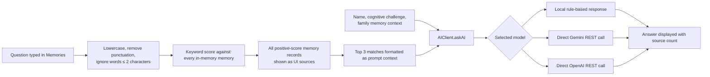

# AI and retrieval

## Status at a glance

The app has a **keyword-retrieval plus response-generation** pipeline. The code and settings call it “RAG”, but it is not semantic retrieval and does not use embeddings, a vector database, reranking, or citations in the generated answer.

The implementation is suitable only for a prototype. It must not be treated as a source of clinical, medication, or other high-stakes guidance.

## Where it is used

| Experience | Entry point | Behaviour |
| --- | --- | --- |
| **Memories search** | [`MemoriesScreen`](../lib/screens/memories_screen.dart) | Runs retrieval as the user types, displays a generated answer, and lists matched memory records below it. |
| **MemoryLens quick questions** | [`LensScreen`](../lib/screens/lens_screen.dart) | Submits two fixed questions through the same search path. |
| **MemoryLens person registration** | [`AIClient.generateMemoryForPerson`](../lib/services/ai_client.dart) | Generates a new, nostalgic memory record from limited person details. This is a separate generation path, not retrieval. |
| **Settings** | [`AppHeader`](../lib/widgets/app_header.dart) | Lets the user choose Local, Gemini, or OpenAI for the current app session. |

## Search and retrieval path

[`MemoryStore.searchMemories`](../lib/services/memory_store.dart) performs the retrieval. For every memory it builds lowercase text from `title`, `detail`, `personName`, and `category`.

- A matching word contributes **1** point.
- A match in `title` contributes an additional **2** points.
- A match in `personName` contributes an additional **3** points.
- Matches are sorted by descending score.
- All positive-score records are returned to the UI as `sources`, but only the first **three** are placed in the model context.

This retrieval currently does **not** search memory tags, relationships, notes, dates, locations, or voice transcripts. It uses simple substring matching, so it has no synonym handling, typo tolerance, Tagalog morphology, semantic similarity, or date reasoning.

## Model selection and fallback

[`AIClient.askAI`](../lib/services/ai_client.dart) receives the selected `AIModel` from `MemoryStore`.

| Selected option | When it runs | Current behaviour |
| --- | --- | --- |
| `local` | Always available | Uses deterministic `if` rules and one context-sentence fallback; no model inference occurs. |
| `gemini` | A Gemini key was loaded | Sends the assembled prompt directly from the mobile app to Gemini 1.5 Flash. |
| `openai` | An OpenAI key was loaded | Sends the assembled prompt directly from the mobile app to `gpt-4o-mini`. |

If the chosen cloud provider has no key, the client selects the other keyed provider, otherwise it selects `local`. This choice is held only in memory; it is not persisted per user or request.

Cloud request failures return an apologetic string that says the app will use local memory, but the current code does **not** actually run `_runLocalModel` after that failure. The user does not receive a retrieved answer in that case.

## What the local model actually does

The local option is a deterministic response formatter, not a language model. After retrieval produced a non-empty context, it checks the question for a few terms:

| Question trigger | Current output behaviour |
| --- | --- |
| `gamot` or `med` | If the context contains `gamot` or `reseta`, gives a fixed medication instruction attributed to Dr. Cruz; otherwise gives a generic medication reminder. |
| `anak` or `anna` | Returns fixed facts about Anna, her visits, and mangoes. |
| `doctor`, `check-up`, or `cruz` | Returns a fixed Monday check-up statement for Dr. Cruz. |
| Other question | Returns the first context sentence longer than 10 characters. |

If retrieval finds no context, it returns a gentle “no record found” message. The local output is currently always Tagalog/Taglish and does not respect the app’s English-language setting.

### Grounding limitation

The Anna, Dr. Cruz, and medication branches contain fixed facts. They can be returned whenever their trigger word appears, even when the retrieved records do not support those specific facts. Therefore the current local response must be labelled as a prototype and not represented as reliably source-grounded.

## Prompt contents and data sent to cloud providers

For cloud mode, the mobile app puts the following into one prompt:

- the user’s name;
- the self-reported cognitive challenge;
- the free-text `memoryContext` gathered during onboarding;
- up to three matched memory records; and
- the user’s question.

The prompt requests warm Taglish, short sentences, and non-hallucinated responses. Prompt instructions help but are not enforcement. `memoryContext` is included even though it is not returned as a displayed source, so an answer may rely on information the source list does not show.

The app currently loads provider keys from `.env` as a Flutter asset and calls providers from the device. This exposes credentials to application users and is not acceptable for production. See [privacy and safety](privacy-and-safety.md).

## Generated-memory path

When MemoryLens registers a person, it can call `generateMemoryForPerson`. The cloud prompt asks the provider to invent a warm, nostalgic memory from person details and return JSON. The local alternative returns a deterministic fabricated JSON record.

This is **creative content**, not a recovered memory. It must never be auto-saved or presented as something that happened. In a production memory companion, require clear review, editing, provenance (`AI draft`), and explicit user/caregiver confirmation before saving it.

## Known implementation limits

- Search starts on every text change; there is no debounce, request cancellation, rate limit, or minimum query length in the UI.
- The screen ignores stale responses before rendering, but in-flight cloud requests may still spend tokens and transmit the typed query.
- The displayed source count reflects all matches, while the cloud model sees only the first three.
- The model response has no structured citations, confidence, refusal state, or audit record.
- Retrieval operates on the process-memory list, which includes sample preset memories and may be merged with one-time Firestore reads.
- Errors loading `.env` are printed and initialization is retried on later requests.
- The language setting does not control the prompt or the local responder.

## Production requirements

1. Move retrieval and all cloud-model calls behind an authenticated server endpoint; do not ship provider secrets in the app.
2. Make retrieval structured and source-first: scope by authorised household, filter by consent and date, retrieve deterministic records, and return stable source IDs.
3. Require every answer to cite only the records actually sent to the model. If evidence is missing, return a clear no-answer state.
4. Replace the hard-coded local facts with templates populated only from retrieved fields, or return no answer when fields are absent.
5. Remove generated-memory fabrication from the default flow. Keep any creative drafting opt-in, visibly labelled, reviewable, and separate from verified memories.
6. Add server-side safety policies for health-adjacent questions, abuse prevention, rate limiting, logging, and provider failure fallback.
7. Add query debouncing, per-request loading/error state, and tests for retrieval ranking, missing evidence, language selection, and prompt/source consistency.
