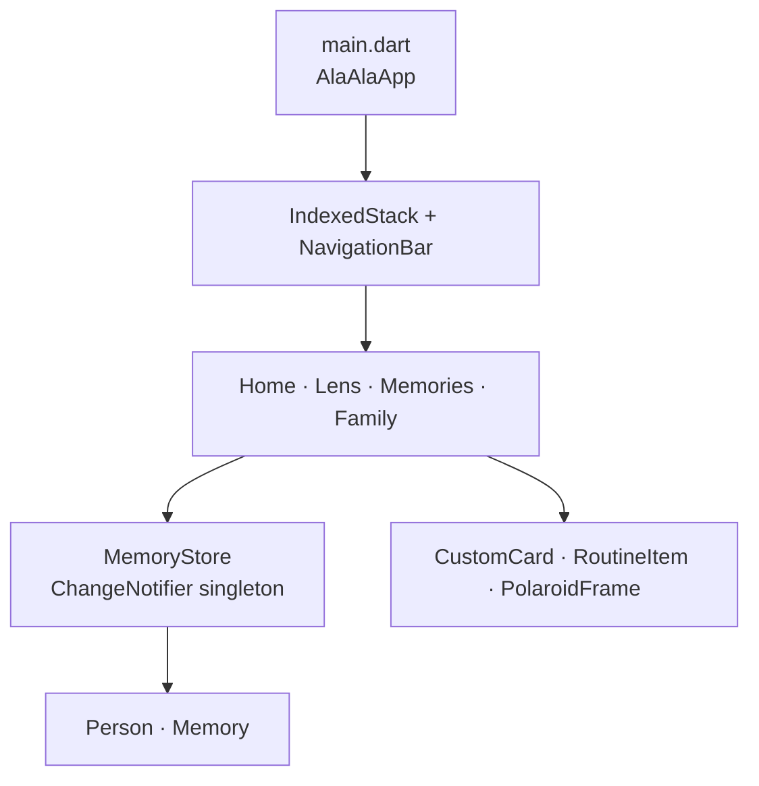

# Architecture

## Overview

Ala-ala is a Flutter application with a single `MaterialApp`, an indexed bottom-navigation shell, screen-focused UI code, simple immutable models, and one in-memory state store.

## Module responsibilities

| Location | Responsibility |
| --- | --- |
| [`lib/main.dart`](../lib/main.dart) | Application theme and the selected bottom-navigation tab. |
| [`lib/screens/`](../lib/screens) | Screen-specific composition and transient UI state. |
| [`lib/widgets/`](../lib/widgets) | Reusable presentational components. |
| [`lib/models/`](../lib/models) | Immutable `Person` and `Memory` records with `copyWith` helpers. |
| [`lib/services/memory_store.dart`](../lib/services/memory_store.dart) | Demo seed data, mutations, orientation data, and memory search. |

## State and data flow

`MemoryStore.instance` is a `ChangeNotifier`. Screens that must redraw after a data update listen with `ListenableBuilder`; mutations such as adding memories, registering a person, incrementing visits, and adding notes call `notifyListeners()`.

The data store deliberately has no persistence layer. `_initPresets()` seeds sample `Person` and `Memory` records in process memory, so closing or restarting the app resets the experience.

## Search behaviour

[`MemoryStore.searchMemories`](../lib/services/memory_store.dart) is a deterministic keyword scorer, not an LLM or semantic-vector service. It:

1. Normalises the query and ignores very short words.
2. Scores matches across a memory’s person, title, detail, category, and tags.
3. Sorts matching memories by score.
4. Builds a Filipino response template from the highest-scoring stored memory.

The UI displays the matching memory records as sources. Any future AI integration must preserve that grounding and make uncertainty clear.

## Extension seams

When adding production capabilities, prefer replacing the current store behind a repository interface rather than embedding service concerns in screens. Keep sensitive-data collection, consent checks, encryption, and camera/biometric processing outside UI widgets and independently testable.
