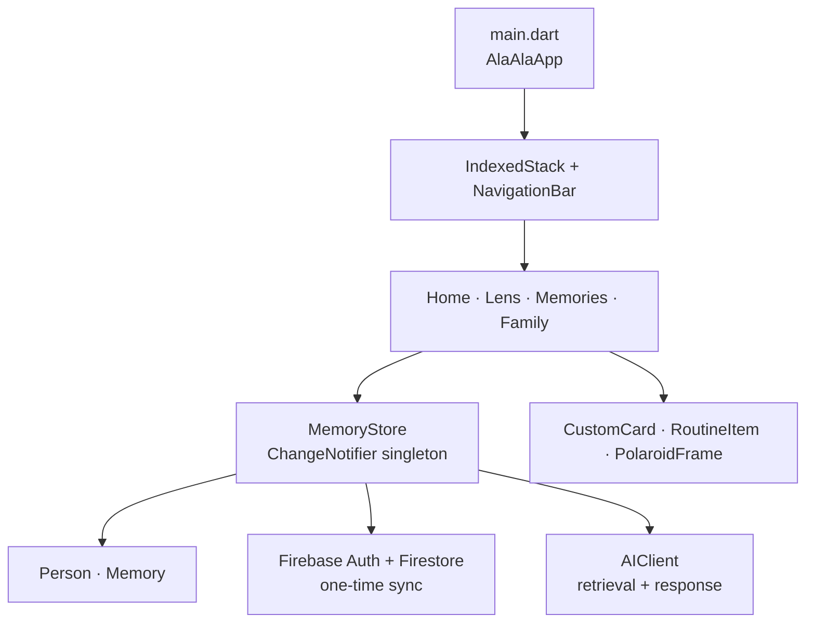

# Architecture

## Overview

Ala-ala is a Flutter application with a single `MaterialApp`, Firebase-backed authentication, an indexed bottom-navigation shell, screen-focused UI code, simple immutable models, and one `ChangeNotifier` state store. The store begins with sample data and performs one-time Firestore reads for an authenticated user.

## Module responsibilities

| Location | Responsibility |
| --- | --- |
| [`lib/main.dart`](../lib/main.dart) | Application theme and the selected bottom-navigation tab. |
| [`lib/screens/`](../lib/screens) | Screen-specific composition and transient UI state. |
| [`lib/widgets/`](../lib/widgets) | Reusable presentational components. |
| [`lib/models/`](../lib/models) | Immutable `Person` and `Memory` records with `copyWith` helpers. |
| [`lib/services/memory_store.dart`](../lib/services/memory_store.dart) | Sample seed data, user profile sync, mutations, language preference, orientation data, and keyword retrieval. |
| [`lib/services/ai_client.dart`](../lib/services/ai_client.dart) | Local rule-based response path and direct cloud-provider request paths. |

## State and data flow

`MemoryStore.instance` is a `ChangeNotifier`. Screens that must redraw after a data update listen with `ListenableBuilder`; mutations such as adding memories, registering a person, incrementing visits, and adding notes call `notifyListeners()`.

`MemoryStore.instance` is a `ChangeNotifier`. Screens that must redraw after a data update listen with `ListenableBuilder`; mutations call `notifyListeners()`. It also reacts to Firebase authentication state: signing in triggers one-time reads of the user profile, memories, and people; signing out restores sample data. The user’s language choice is stored locally with `SharedPreferences`.

The Firestore reads are not live subscriptions. Sample people and memories remain part of the active data set, and write failures are currently ignored. The app therefore does not yet have production-grade sync or offline conflict handling.

## Search behaviour

See [AI & retrieval](ai-and-retrieval.md) for the implemented keyword scorer, Local/Gemini/OpenAI selection, prompt contents, and its current grounding limits.

## Extension seams

When adding production capabilities, prefer replacing the current store behind a repository interface rather than embedding service concerns in screens. Keep sensitive-data collection, consent checks, encryption, and camera/biometric processing outside UI widgets and independently testable.
